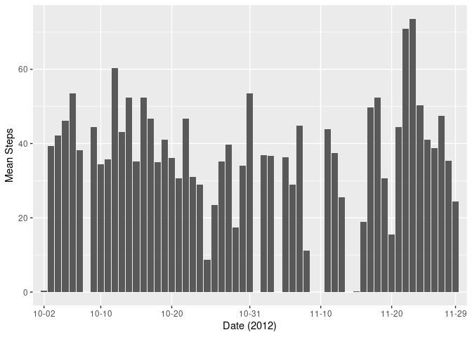

## Loading and preprocessing the data


```r
temp <- tempfile()
download.file("https://d396qusza40orc.cloudfront.net/repdata%2Fdata%2Factivity.zip",
              temp, mode = "wb")
file <- unz(temp, "activity.csv")
data <- read.csv(file)
unlink(temp)
```

Now we'll take a look at the data briefly to determine if any preprocessing is needed  

```r
summary(data)
```

```
##      steps                date          interval     
##  Min.   :  0.00   2012-10-01:  288   Min.   :   0.0  
##  1st Qu.:  0.00   2012-10-02:  288   1st Qu.: 588.8  
##  Median :  0.00   2012-10-03:  288   Median :1177.5  
##  Mean   : 37.38   2012-10-04:  288   Mean   :1177.5  
##  3rd Qu.: 12.00   2012-10-05:  288   3rd Qu.:1766.2  
##  Max.   :806.00   2012-10-06:  288   Max.   :2355.0  
##  NA's   :2304     (Other)   :15840
```

It seems every date has 288 readings, let's make sure that's true across the whole dataset.  

```r
all(summary(data$date)==288)
```

```
## [1] TRUE
```


It's also seen here that `data$steps` has some NAs, so let's see what dates those occured and how many.  

```r
datesOfNA <- summary(data$date[is.na(data$steps)])
datesOfNA[datesOfNA != 0]
```

```
## 2012-10-01 2012-10-08 2012-11-01 2012-11-04 2012-11-09 2012-11-10 2012-11-14 
##        288        288        288        288        288        288        288 
## 2012-11-30 
##        288
```
Looks like the steps weren't recorded on certain days. We'll store these dates in a variable for later use.  

```r
datesOfNASteps <- names(datesOfNA[datesOfNA != 0])
```


## What is mean total number of steps taken per day?

```r
library(tidyverse)
meanPerDay <- data %>% group_by(date) %>%
        summarize(mean = mean(steps, na.rm = TRUE))
```

NOTE: I wanted to create a nice table but this would involve using `tabularx` and diving deeper into LaTeX. Since this assignment is focussing on just knitr I'll have to put that reasearch off for another time  

```r
##Split up columns by month for easier viewing
oct <- filter(meanPerDay,
                months.Date(as.Date(meanPerDay$date)) == "October")
byMonthMeans <- cbind(oct,
                    rbind(filter(meanPerDay,
                months.Date(as.Date(meanPerDay$date)) == "November"),
                c(NA, NA)))

colnames(byMonthMeans) <- c("October", "Means", "November", "Means")
```

```r
library(xtable)
table <- xtable(byMonthMeans)
print(table, include.rownames = FALSE, type = "html")
```

<!-- html table generated in R 3.6.3 by xtable 1.8-4 package -->
<!-- Wed May  6 23:11:22 2020 -->
<table border=1>
<tr> <th> October </th> <th> Means </th> <th> November </th> <th> Means </th>  </tr>
  <tr> <td> 2012-10-01 </td> <td align="right">  </td> <td> 2012-11-01 </td> <td align="right">  </td> </tr>
  <tr> <td> 2012-10-02 </td> <td align="right"> 0.44 </td> <td> 2012-11-02 </td> <td align="right"> 36.81 </td> </tr>
  <tr> <td> 2012-10-03 </td> <td align="right"> 39.42 </td> <td> 2012-11-03 </td> <td align="right"> 36.70 </td> </tr>
  <tr> <td> 2012-10-04 </td> <td align="right"> 42.07 </td> <td> 2012-11-04 </td> <td align="right">  </td> </tr>
  <tr> <td> 2012-10-05 </td> <td align="right"> 46.16 </td> <td> 2012-11-05 </td> <td align="right"> 36.25 </td> </tr>
  <tr> <td> 2012-10-06 </td> <td align="right"> 53.54 </td> <td> 2012-11-06 </td> <td align="right"> 28.94 </td> </tr>
  <tr> <td> 2012-10-07 </td> <td align="right"> 38.25 </td> <td> 2012-11-07 </td> <td align="right"> 44.73 </td> </tr>
  <tr> <td> 2012-10-08 </td> <td align="right">  </td> <td> 2012-11-08 </td> <td align="right"> 11.18 </td> </tr>
  <tr> <td> 2012-10-09 </td> <td align="right"> 44.48 </td> <td> 2012-11-09 </td> <td align="right">  </td> </tr>
  <tr> <td> 2012-10-10 </td> <td align="right"> 34.38 </td> <td> 2012-11-10 </td> <td align="right">  </td> </tr>
  <tr> <td> 2012-10-11 </td> <td align="right"> 35.78 </td> <td> 2012-11-11 </td> <td align="right"> 43.78 </td> </tr>
  <tr> <td> 2012-10-12 </td> <td align="right"> 60.35 </td> <td> 2012-11-12 </td> <td align="right"> 37.38 </td> </tr>
  <tr> <td> 2012-10-13 </td> <td align="right"> 43.15 </td> <td> 2012-11-13 </td> <td align="right"> 25.47 </td> </tr>
  <tr> <td> 2012-10-14 </td> <td align="right"> 52.42 </td> <td> 2012-11-14 </td> <td align="right">  </td> </tr>
  <tr> <td> 2012-10-15 </td> <td align="right"> 35.20 </td> <td> 2012-11-15 </td> <td align="right"> 0.14 </td> </tr>
  <tr> <td> 2012-10-16 </td> <td align="right"> 52.38 </td> <td> 2012-11-16 </td> <td align="right"> 18.89 </td> </tr>
  <tr> <td> 2012-10-17 </td> <td align="right"> 46.71 </td> <td> 2012-11-17 </td> <td align="right"> 49.79 </td> </tr>
  <tr> <td> 2012-10-18 </td> <td align="right"> 34.92 </td> <td> 2012-11-18 </td> <td align="right"> 52.47 </td> </tr>
  <tr> <td> 2012-10-19 </td> <td align="right"> 41.07 </td> <td> 2012-11-19 </td> <td align="right"> 30.70 </td> </tr>
  <tr> <td> 2012-10-20 </td> <td align="right"> 36.09 </td> <td> 2012-11-20 </td> <td align="right"> 15.53 </td> </tr>
  <tr> <td> 2012-10-21 </td> <td align="right"> 30.63 </td> <td> 2012-11-21 </td> <td align="right"> 44.40 </td> </tr>
  <tr> <td> 2012-10-22 </td> <td align="right"> 46.74 </td> <td> 2012-11-22 </td> <td align="right"> 70.93 </td> </tr>
  <tr> <td> 2012-10-23 </td> <td align="right"> 30.97 </td> <td> 2012-11-23 </td> <td align="right"> 73.59 </td> </tr>
  <tr> <td> 2012-10-24 </td> <td align="right"> 29.01 </td> <td> 2012-11-24 </td> <td align="right"> 50.27 </td> </tr>
  <tr> <td> 2012-10-25 </td> <td align="right"> 8.65 </td> <td> 2012-11-25 </td> <td align="right"> 41.09 </td> </tr>
  <tr> <td> 2012-10-26 </td> <td align="right"> 23.53 </td> <td> 2012-11-26 </td> <td align="right"> 38.76 </td> </tr>
  <tr> <td> 2012-10-27 </td> <td align="right"> 35.14 </td> <td> 2012-11-27 </td> <td align="right"> 47.38 </td> </tr>
  <tr> <td> 2012-10-28 </td> <td align="right"> 39.78 </td> <td> 2012-11-28 </td> <td align="right"> 35.36 </td> </tr>
  <tr> <td> 2012-10-29 </td> <td align="right"> 17.42 </td> <td> 2012-11-29 </td> <td align="right"> 24.47 </td> </tr>
  <tr> <td> 2012-10-30 </td> <td align="right"> 34.09 </td> <td> 2012-11-30 </td> <td align="right">  </td> </tr>
  <tr> <td> 2012-10-31 </td> <td align="right"> 53.52 </td> <td>  </td> <td align="right">  </td> </tr>
   </table>


```r
## means as a plot  
dateBreaks <-as.character(
        meanPerDay$date[c(2,10,20,31,31+10,31+20,31+29)])
dateLabels <-  gsub("2012-", "", dateBreaks)
plot <- ggplot(meanPerDay, aes(date, mean))
plot + 
        geom_col() +
        xlab("Date (2012)") +
        scale_x_discrete(breaks = dateBreaks, labels = dateLabels) +
        ylab("Mean Steps")
```

<!-- -->


## What is the average daily activity pattern?


## Imputing missing values


## Are there differences in activity patterns between weekdays and weekends?
